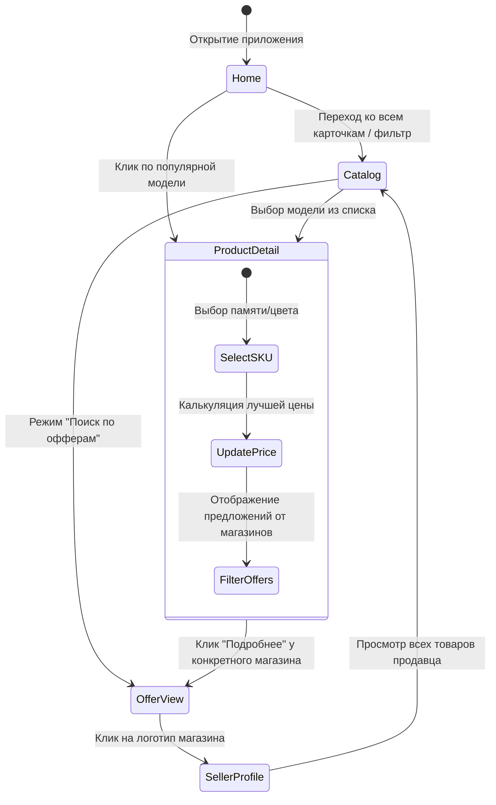

# Functional Specification Document (FSD)
## Проект: SotkaMarket

Данный документ представляет собой **Функциональную Спецификацию (FSD)** для проекта SotkaMarket. Он описывает требования к функциональности, логике работы системы, взаимодействию пользователя с интерфейсом и ключевым бизнес-сценариям.

---

## 1. Введение и цели продукта
**SotkaMarket** — это PWA-платформа, маркетплейс-витрина для агрегации предложений мобильной электроники. 
**Бизнес-цель:** предоставить пользователям единый хаб для сравнения цен, поиска новых и Б/У устройств, а также навигации по физическим магазинам на карте.

## 2. Роли пользователей (Actors)
На текущем этапе (MVP) система поддерживает две основные роли:
1. **Unauthenticated User (Гость):** Имеет доступ ко всем разделам (витрина, каталог, карточки товаров, профили продавцов, поиск на карте). Может сохранять товары в корзину/избранное (данные сохраняются в локальном хранилище браузера).
2. **Authenticated User (Авторизованный покупатель):** (Требует реализации на стороне бэкенда). Синхронизация избранного между устройствами, возможность оставлять отзывы (out of scope для MVP).

---

## 3. Пользовательские пути (User Journeys)

---

## 4. Требования к функциональным модулям (Functional Requirements)

### FR-1: Главная Витрина (Home Page)
* **FR-1.1:** Система должна отображать промо-баннеры (Hero Slider).
* **FR-1.2:** Выделение блоков "Трендовые товары" (формируются на основе рейтинга, > 4.7) и "Выгодные предложения" (предложения со специальными флагами скидок).
* **FR-1.3:** Блок "Найти на карте". Пользователь вводит текст, система фильтрует маркеры магазинов на встроенной карте Leaflet.

### FR-2: Каталог товаров и предложений (Catalog)
Каталог имеет два основных режима (Views):
* **FR-2.1: Режим "Модели" (Products):** Отображает агрегированные карточки моделей (например, базовый "iPhone 16 Pro"). В карточке должна фигурировать стартовая цена (minPrice среди предложений).
* **FR-2.2: Режим "Предложения" (Offers):** Отображает конкретные физические лоты магазинов.
* **FR-2.3: Фильтрация:** 
    * Динамический Offcanvas фильтр для мобильных устройств, Sidebar для Десктопа.
    * Поддерживаемые параметры: Класс (Телефон/Планшет), Бренд, Состояние (Новый/Б-У), Диапазон цен.
* **FR-2.4: Сортировка:** Поддержка сортировки "По популярности", "Сначала дешевые", "Сначала дорогие".

### FR-3: Карточка Модели (Product Details)
* **FR-3.1: Выбор конфигурации (SKU Mapping):** При смене ползунка Памяти (128GB -> 256GB) или цвета, система обновляет `variantId`.
* **FR-3.2: Динамический пересчет:** Изменение конфигурации автоматически скрывает предложения, которые не соответствуют данному SKU, и обновляет "Стартовую" цену.
* **FR-3.3: Секция продавцов:** Список всех офферов этого SKU с указанием названия магазина, цены, гарантии и бэйджа "В наличии".

### FR-4: Система Избранного (Favorites System)
* **FR-4.1:** Пользователь может кликнуть на иконку "Сердце" в любой карточке товара или предложения.
* **FR-4.2:** Состояние (Array of IDs) должно персистентно сохраняться в `localStorage` (ключ `tm_favorites`).
* **FR-4.3:** Счетчики лайков на карточках должны реактивно закрашиваться в красный цвет при добавлении в избранное.

### FR-5: Интерактивная Карта (Store Locator Map)
* **FR-5.1:** Графическое отображение (интеграция Leaflet).
* **FR-5.2:** Гео-маркеры наносятся на основе координат `[lat, lng]` из профиля продавцов.
* **FR-5.3:** Интеракция: При клике на маркер открывается Popup-всплывающее окно с карточкой магазина и кнопкой "Перейти в каталог продавца".

### FR-6: Progressive Web App (PWA)
* **FR-6.1:** Service Worker осуществляет фоновое кеширование статических файлов (HTML, CSS, JS, Иконки).
* **FR-6.2:** Должна присутствовать возможность "Install to Home Screen" для мобильных Chrome и Safari.
* **FR-6.3:** При отсутствии интернета открытые ранее страницы и скелетоны UI должны загружаться (офлайн-режим кэша).

---

## 5. Обработка Состояний и Ограничения (Edge Cases)

| Сценарий | Правило Обработки (Business Logic) | Сообщение для UI / Fallback |
| :--- | :--- | :--- |
| **Пустой Каталог** | Применение фильтров дало 0 результатов. | Скрыть скелетоны, вывести `Empty-State` с текстом: "По вашему запросу ничего не найдено". Кнопка "Сбросить фильтры". |
| **Отсутствие конкретного SKU** | Пользователь выбрал цвет, которого в данный момент нет у продавцов. | Скрыть список офферов. Вывести: "По данной конфигурации предложений сейчас нет". |
| **Оффлайн / Сбой Сети** | Отсутствует подключение к API при переходе на новые страницы. | Блок-заглушка: "Нет подключения к интернету". |
| **Переход по битой ссылке (ID)** | Роутинг не находит по ID модель в Data Store. | Редирект на главную страницу или экран "Ошибка 404 - Товар не найден". |

---

## 6. Принятые допущения (Assumptions)
1. **Frontend-Driven State:** В рамках MVP фильтрация продуктов и пересчет стейтов происходит полностью на клиенте (генерация виртуального DOM из локального массив-мока). В production данные будут поставляться через пагинированные Fetch-подключения к REST API.
2. **Hash History:** Маршрутизация построена на событиях `hashchange` (URL вида `#/catalog?brand=apple`) для совместимости с любым дешевым хостингом (GitHub Pages и аналоги), избегая необходимости Rewrite Rules (как было бы для History API).
